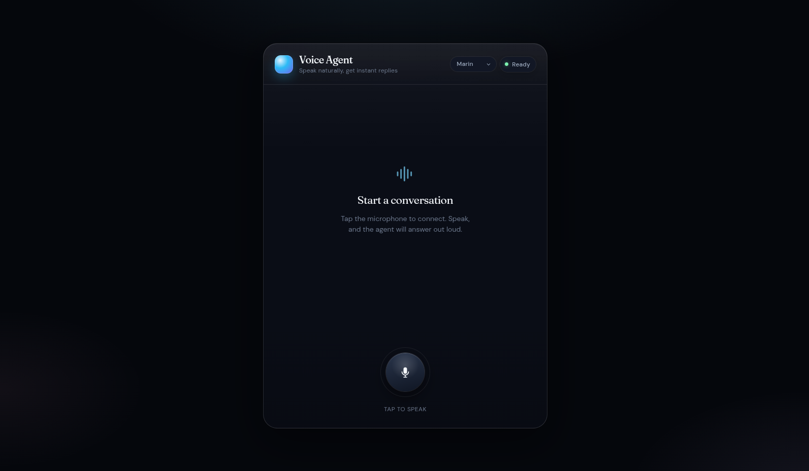

# Voice Agent

A browser voice assistant built on the [OpenAI Realtime API](https://platform.openai.com/docs/guides/realtime) via the [`@openai/agents`](https://openai.github.io/openai-agents-js/) SDK. Tap the mic, speak, and the agent answers out loud — with live CC-style captions while it talks and a full transcript when you hang up.



## Features

- **Realtime voice conversation** over WebRTC (`gpt-realtime-2.1`)
- **Live captions** — the current speaker's words appear in short, subtitle-sized chunks paced to roughly match the speech, instead of a wall of text
- **Full transcript** — the complete conversation renders as a chat once the call ends
- **Noise robustness** — far-field noise reduction, tuned server VAD (threshold 0.8), and the mic is muted for the agent's whole turn (thinking + speaking, plus a 600 ms echo guard) so background noise and speaker echo can't trigger phantom responses
- **Voice picker** — 10 OpenAI voices selectable in the header (persisted in `localStorage`; applies on the next call, since a voice is fixed per session)

## Setup

```bash
pnpm install
cp .env.example .env.local   # add your OpenAI API key
pnpm dev
```

Open <http://localhost:5173>, allow microphone access, and tap the mic button.

The API key never reaches the browser: a small Vite middleware (`vite.config.ts`) exposes `POST /api/realtime-session`, which mints a short-lived OpenAI client secret server-side. The React app connects to the Realtime API with that ephemeral key.

## Project structure

| File | Purpose |
| --- | --- |
| `src/App.tsx` | UI, session lifecycle, caption pacing, mute/unmute logic |
| `src/voiceAgent.ts` | Session factory (model, voice, VAD/noise config), transcript helpers |
| `src/icons.tsx` | SVG icon components |
| `src/App.css` | All styling |
| `vite.config.ts` | Dev server + `/api/realtime-session` token endpoint |

## Scripts

```bash
pnpm dev       # dev server with the token middleware
pnpm build     # type-check + production build
pnpm preview   # serve the production build (token middleware included)
pnpm lint      # eslint
```

## Tuning

In `src/App.tsx`:

- `CAPTION_CHARS_PER_SECOND` (12) — raise if captions lag the voice, lower if they run ahead
- `CAPTION_MAX_CHARS` (90) — max caption chunk length

In `src/voiceAgent.ts`:

- `turnDetection.threshold` (0.8) — lower to ~0.7 if the agent misses quiet speech, raise toward 0.9 if noise still triggers it
- `noiseReduction` — `far_field` suits laptop mics; switch to `near_field` for a headset
